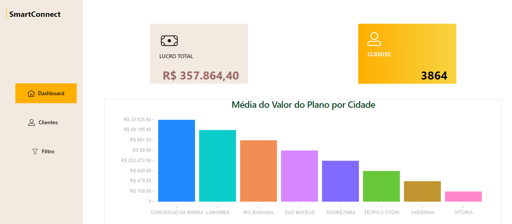

  <a href="#-layout">Layout</a>&nbsp;&nbsp;&nbsp;|&nbsp;&nbsp;&nbsp;
  <a href="#memo-licença">Licença</a>

 

  

 

  

## 🔖 Layout

Você pode visualizar o projeto através [desse link](https://smart-connect-system.vercel.app/).

Você pode visualizar a api do projeto através [desse link](https://api-project-xnhe.onrender.com/).

## :memo: Licença

Esse projeto está sob a licença MIT. Veja o arquivo [LICENSE](LICENSE.md) para mais detalhes.